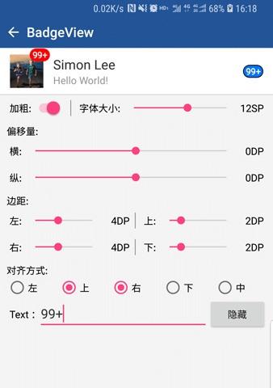

# :star2:&nbsp;BadgeView

简单易用的角标控件，可实现任意View的角标指示，支持SDK19(Android4.4)及以上。

## 目录

* [示例demo](#示例demo)
* [实现原理](#实现原理)
* [集成方式](#集成方式)
* [使用方式](#使用方式)
* [接口说明](#接口说明)
* [属性说明](#属性说明)
* [注意事项](#注意事项)

## 示例demo

|Demo下载(1.5MB)|示例效果|
|:---:|:---:|
|[点此下载](http://fir.im/SLWidget) 或扫描下面二维码<br/>[](http://fir.im/SLWidget  "扫码下载示例程序")|[](http://fir.im/SLWidget  "示例效果")|

## 实现原理

在自定义View的`void dispatchDraw(Canvas canvas)`方法中绘制角标。

## 集成方式

在module的`build.gradle`中添加如下代码
```
    dependencies {
        implementation 'cn.simonlee.widget:badgeview:1.0.6'
    }
```

## 使用方式

角标的使用方式有两种，一种是直接使用项目中的BadgeView作为角标使用即可。还有一种是通过自定义View来实现任意View的角标显示。

* **Pattern.1**

    直接使用`cn.simonlee.widget.badgeview.BadgeView`组件，通过`getBadge()`获取Badge对象进行操作。

* **Pattern.2**

    1. 自定义View，在构造方法中创建Badge实例。
    2. 重写`dispatchDraw(...)`方法，调用Badge的`dispatchDraw(...)`方法。
    3. 通过`getBadge()`获取Badge对象进行操作。
     ```java
     //示例：一个带角标的ImageView
     public class BadgeImageView extends AppCompatImageView {

         private final Badge mBadge;

         public BadgeImageView(Context context) {
             super(context);
             mBadge = new Badge(this, null);
         }

         public BadgeImageView(Context context, AttributeSet attrs) {
             super(context, attrs);
             mBadge = new Badge(this, attrs);
         }

         public BadgeImageView(Context context, AttributeSet attrs, int defStyleAttr) {
             super(context, attrs, defStyleAttr);
             mBadge = new Badge(this, attrs);
         }

         @Override
         public void dispatchDraw(Canvas canvas) {
             super.dispatchDraw(canvas);
             mBadge.dispatchDraw(canvas);
         }

         public Badge getBadge() {
             return mBadge;
         }

     }
     ```

## 接口说明

|接口|说明|
|:---:|:---:|
|String getBadgeText()|获取当前角标文本|
|`void` setBadgeText(String badgeText)|设置角标文本，当为`null`时不显示角标，当长度为0时，显示小圆点|

## 属性说明

* **对齐方式**

    |KEY|VALUE|
    |:---:|:---:|
    |属性名|badge_gravity|
    |类型|flag(`left` &#124; `top` &#124; `right` &#124; `bottom` &#124; `center` &#124; `fill`)|
    |默认值|top &#124; right|
    |API|`void` setBadgeGravity(`int` gravity)|
    |说明|无|

* **角标背景**

    |KEY|VALUE|
    |:---:|:---:|
    |属性名|badge_background|
    |类型|reference &#124; color|
    |默认值|Color.RED(GradientDrawable)|
    |API|`void` setBadgeBackground(Drawable drawable)|
    |说明|指定角标的背景。<br/>注意：如果需要圆角，需自行使用shape或GradientDrawable实现|

* **字体大小**

    |KEY|VALUE|
    |:---:|:---:|
    |属性名|badge_textSize|
    |类型|dimension|
    |默认值|12sp|
    |API|`void` setBadgeTextSize(`float` size)|
    |说明|API中的单位为px，必须大于0|

* **字体颜色**

    |KEY|VALUE|
    |:---:|:---:|
    |属性名|badge_textColor|
    |类型|color|
    |默认值|Color.WHITE|
    |API|`void` setBadgeTextColor(`int` color)|
    |说明|无|

* **字体加粗**

    |KEY|VALUE|
    |:---:|:---:|
    |属性名|badge_boldText|
    |类型|boolean|
    |默认值|true|
    |API|`void` setBadgeBoldText(`boolean` boldEnable)|
    |说明|无|

* **小圆点半径**

    |KEY|VALUE|
    |:---:|:---:|
    |属性名|badge_dotRadius|
    |类型|dimension|
    |默认值|5dp|
    |API|`void` setBadgeDotRadius(`float` dotRadius)|
    |说明|API中的单位为px，当角标文本长度为0时仅显示一个小圆点|

* **角标内边距**

    |KEY|VALUE|
    |:---:|:---:|
    |属性名|badge_padding ( badge_paddingLeft &#124; badge_paddingTop &#124; badge_paddingRight &#124; badge_paddingBottom )|
    |类型|dimension|
    |默认值|4dp（左、右） &#124; 2dp（上、下）|
    |API|`void`  setBadgePadding...(float... padding)|
    |说明|API中的单位为px|

* **角标外边距**

    |KEY|VALUE|
    |:---:|:---:|
    |属性名|badge_margin ( badge_marginLeft &#124; badge_marginTop &#124; badge_marginRight &#124; badge_marginBottom )|
    |类型|dimension|
    |默认值|0dp|
    |API|`void`  setBadgeMargin...(float... margin)|
    |说明|API中的单位为px|

## 注意事项

* **Tips.1**

    当角标文本为`null`时不显示角标，当长度为0时，显示一个小圆点。

## 关于作者

限于个人能力有限，些许疏忽失误，欢迎指正。如果提Issue回复不及时可以微信联系我。
如果您觉得有用，请不吝点**Star**:blush:

|Author|E-mail|博客|WeChat|
|:---:|:---:|:---:|:---:|
|Simon Lee|jmlixiaomeng@163.com|[简书](https://www.jianshu.com/u/c35bd597dafb) · [掘金](https://juejin.im/user/5a38846b6fb9a04528469a89)||