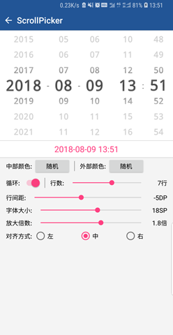
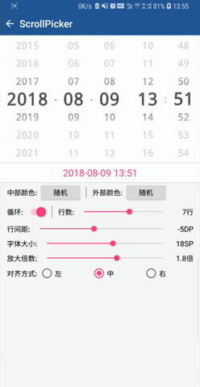

# :star2:&nbsp;ScrollPicker

滚动选择控件（仅文本），支持SDK14(Android4.0)及以上。

## 目录

* [示例demo](#示例demo)
* [功能介绍](#功能介绍)
* [集成方式](#集成方式)
* [使用方式](#使用方式)
* [接口说明](#接口说明)
* [属性说明](#属性说明)
* [版本记录](#版本记录)
* [关于作者](#关于作者)

## 示例demo

|Demo下载(1.5MB)|示例效果|
|:---:|:---:|
|[点此下载](https://d.firim.pro/SLWidget) 或扫描下面二维码<br/>[](https://d.firim.pro/SLWidget  "扫码下载示例程序")|&#32;&#32;&#32;|

## 功能介绍

带放大及颜色渐变效果的滚动选择控件，仅支持文本显示。可设置行数、间距、放大倍数、颜色渐变、对齐方式等。

## 集成方式

在module的`build.gradle`中添加如下代码
```
    dependencies {
        implementation 'cn.simonlee.widget:scrollpicker:1.0.11'
    }
```

## 使用方式

示例日期选择
* **STEP.1**

    构造一个适配器继承自`cn.simonlee.widget.scrollpicker.PickAdapter`，主要实现`int getCount()`和`String getItem(int position)`两个方法。
    ```java
    public class DatePickerAdapter implements PickAdapter {

        private int mMinValue, mMaxValue;
        private final DecimalFormat mDecimalFormat;

        public DatePickerAdapter(int minValue, int maxValue, DecimalFormat decimalFormat) {
            this.mMinValue = minValue;
            this.mMaxValue = maxValue;
            this.mDecimalFormat = decimalFormat;
        }

        @Override
        public int getCount() {
            return mMaxValue - mMinValue + 1;
        }

        @Override
        public String getItem(int position) {
            if (position >= 0 && position < getCount()) {
                return mDecimalFormat.format(mMinValue + position);
            }
            return null;
        }

        public int getDate(int position) {
            if (position >= 0 && position < getCount()) {
                return mMinValue + position;
            }
            return 0;
        }

        public int indexOf(int value) {
            if (value < mMinValue || value > mMaxValue) {
                return -1;
            }
            return value - mMinValue;
        }

    }
    ```

* **STEP.2**

    在Activity的`onCreate`方法中获取`ScrollPickerView`实例，并配置适配器、数据源，设置监听。
    ```java
        @Override
        public void onCreate(@Nullable Bundle savedInstanceState) {
            super.onCreate(savedInstanceState);
            setContentView(R.layout.activity_scrollpicker);

            mPicker_Year = findViewById(R.id.datepicker_year);
            mPicker_Month = findViewById(R.id.datepicker_month);
            mPicker_Day = findViewById(R.id.datepicker_day);

            mYearAdapter = new DatePickerAdapter(1800, 2200,new DecimalFormat("0000"));
            mMonthAdapter = new DatePickerAdapter(1, 12, new DecimalFormat("00"));
            mDayAdapter = new DatePickerAdapter(1, 31, new DecimalFormat("00"));

            mPicker_Year.setAdapter(mYearAdapter);
            mPicker_Month.setAdapter(mMonthAdapter);
            mPicker_Day.setAdapter(mDayAdapter);

            mPicker_Year.setOnItemSelectedListener(this);
            mPicker_Month.setOnItemSelectedListener(this);
            mPicker_Day.setOnItemSelectedListener(this);
        }
    ```

* **STEP.3**

    在监听回调中处理选中事件，以及数据联动
    ```java
        @Override
        public void onItemSelected(View view, int position) {
            switch (view.getId()) {
                case R.id.datepicker_year: {
                    mSelectedYear = mYearAdapter.getDate(position);
                    resetMaxDay();//根据年月计算日期的最大值，并刷新
                    break;
                }
                case R.id.datepicker_month: {
                    mSelectedMonth = mMonthAdapter.getDate(position);
                    resetMaxDay();//根据年月计算日期的最大值，并刷新
                    break;
                }
                case R.id.datepicker_day: {
                    mSelectedDay = mDayAdapter.getDate(position);
                    break;
                }
                default:{
                    break;
                }
            }
            mTextView_Result.setText(mSelectedYear + "-" + mSelectedMonth + "-" + mSelectedDay);
        }
    ```

## 接口说明

|接口|说明|
|:---:|:---:|
|`boolean` isLoopEnable()|是否开启循环|
|`void` setLoopEnable(`boolean` enable)|开启/关闭循环|
|`int` getSelectedPosition()|获取当前选中的position|
|`void` setSelectedPosition(`int` position)|设置当前选中项|
|`void` setAdapter(PickAdapter adapter)|设置适配器|
|`void` setOnItemSelectedListener(OnItemSelectedListener itemSelectedListener)|设置选中监听|

## 属性说明

* **行数**

    |KEY|VALUE|
    |:---:|:---:|
    |属性名|scrollpicker_rows|
    |类型|integer|
    |默认值|5|
    |API|`void` setTextRows(`int` rows)|
    |说明|该属性仅当控件高为 wrap_content 时有效|

* **行间距**

    |KEY|VALUE|
    |:---:|:---:|
    |属性名|scrollpicker_spacing|
    |类型|dimension|
    |默认值|0dp|
    |API|`void` setRowSpacing(`float` rowSpacing)|
    |说明|API中的单位为px|

* **字体大小**

    |KEY|VALUE|
    |:---:|:---:|
    |属性名|scrollpicker_textSize|
    |类型|dimension|
    |默认值|16sp|
    |API|`void` setTextSize(`float` textSize)|
    |说明|API中的单位为px，此属性指的是未选中的item字体大小|

* **字体格式**

    |KEY|VALUE|
    |:---:|:---:|
    |属性名|scrollpicker_textFormat|
    |类型|string|
    |默认值|`NULL`|
    |API|无|
    |说明|用于计算字符宽度，以调整控件宽度。仅当控件宽为 wrap_content 时有效|

* **字体放大倍数**

    |KEY|VALUE|
    |:---:|:---:|
    |属性名|scrollpicker_textRatio|
    |类型|float|
    |默认值|2|
    |API|`void` setTextRatio(`float` textRatio)|
    |说明|选中的item相较于未选中的item字体放大倍数|

* **字体放大倍数**

    |KEY|VALUE|
    |:---:|:---:|
    |属性名|scrollpicker_textRatio|
    |类型|float|
    |默认值|2|
    |API|`void` setTextRatio(`float` textRatio)|
    |说明|选中的item相较于未选中的item字体放大倍数|

* **选中字体颜色**

    |KEY|VALUE|
    |:---:|:---:|
    |属性名|scrollpicker_textColor_center|
    |类型|color|
    |默认值|0xFFDD8822|
    |API|`void` setCenterTextColor(`int` color)|
    |说明|选中字体的颜色，位于中部|

* **未选中字体颜色**

    |KEY|VALUE|
    |:---:|:---:|
    |属性名|scrollpicker_textColor_outside|
    |类型|color|
    |默认值|0xFFFFDD99|
    |API|`void` setOutsideTextColor(`int` color)|
    |说明|未选中字体的颜色，位于外部|

## 版本记录

*  **V1.0.11**   `2019/04/15`

    1. targetSdkVersion 27 -> 28.

## 关于作者

限于个人能力有限，些许疏忽失误，欢迎指正。如果提Issue回复不及时可以微信联系我。
如果您觉得有用，请不吝点**Star**:blush:

|Author|E-mail|博客|WeChat|
|:---:|:---:|:---:|:---:|
|Simon Lee|jmlixiaomeng@163.com|[简书](https://www.jianshu.com/u/c35bd597dafb) · [掘金](https://juejin.im/user/5a38846b6fb9a04528469a89)||

