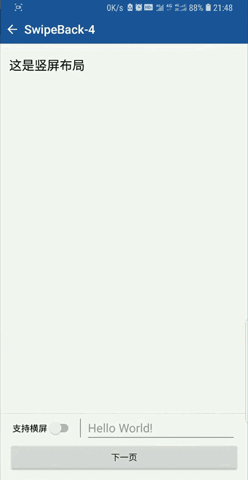
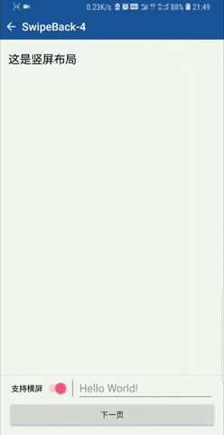
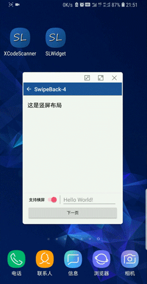

# :star2:&nbsp;SWipeBack

Android侧滑返回方案，实现沉浸式状态栏，支持SDK19(Android4.4)及以上。

## 目录

* [示例demo](#示例demo)
* [实现原理](#实现原理)
* [集成方式](#集成方式)
* [使用方式](#使用方式)
* [注意事项](#注意事项)
* [版本记录](#版本记录)
* [关于作者](#关于作者)

## 示例demo

* **Demo下载(1.5MB)**

    [点此下载](http://fir.im/SLWidget) 或扫描下方二维码

    [](http://fir.im/SLWidget  "扫码下载示例程序")

* **示例效果**

    |侧滑|屏幕旋转|窗口模式|
    |:---:|:---:|:---:|
    ||||

## 实现原理

侧滑时利用反射将窗口转为透明，结束后再利用反射将窗口还原为不透明。

注：在Android9.0中禁止使用非SDK接口，但是窗口透明转换均属于浅灰名单，目前不受限制。

[详细分析](https://www.jianshu.com/p/26fac8d30058)

## 集成方式

在module的`build.gradle`中添加如下代码
```
    dependencies {
        implementation 'cn.simonlee.widget:swipeback:1.0.15'
    }
```

## 使用方式

* **Step.1**

    在styles中配置如下属性
    ```java
    <item name="windowActionModeOverlay">true</item>
    <item name="android:windowBackground">@android:color/transparent</item>
    ```

* **Step.2**

    在Activity的`onCreate`方法中获取`SwipeBackHelper`实例
    ```java
    @Override
    public void onCreate(Bundle savedInstanceState) {
        super.onCreate(savedInstanceState);
        setContentView(R.layout.activity_swipeback);
        if (Build.VERSION.SDK_INT >= Build.VERSION_CODES.KITKAT) {
            mSwipeBackHelper = new SwipeBackHelper(this);
            //设置窗口背景颜色，以覆盖不可见区域的黑色背景（不可见区域常见为当输入法及导航栏变化时的背景）
            mSwipeBackHelper.setWindowBackgroundColor(getResources().getColor(R.color.colorWindowBackground));
        }
    }
    ```

* **Step.3**

    在Activity的`dispatchTouchEvent`和`onTouchEvent`中分发触摸事件，如果仅希望侧边触发，可以不用`onTouchEvent`
    ```java
    @Override
    public boolean dispatchTouchEvent(MotionEvent event) {
        if (mSwipeBackHelper != null) {
            mSwipeBackHelper.dispatchTouchEvent(event);
        }
        return super.dispatchTouchEvent(event);
    }

    @Override
    public boolean onTouchEvent(MotionEvent event) {
        if (mSwipeBackHelper != null) {
            mSwipeBackHelper.onTouchEvent(event);
        }
        return super.onTouchEvent(event);
    }
    ```

* **Step.4**

    仔细阅读注意事项。

## 注意事项

* **Tips.1**

    如需要适配SDK21(Android5.0)以下，必须在styles中配置如下属性。SDK21及以上无需此属性
    ```java
   <item name="android:windowIsTranslucent">true</item>
    ```

* **Tips.2**

    因状态栏透明，输入法的adjustPan模式不会生效，建议设置为adjustResize

* **Tips.3**

    因状态栏透明，布局会从屏幕顶端开始绘制，需自行调整paddingTop
    ```java
    //获取状态栏的高度
    public int getStatusBarHeight() {
        int resourceId = getResources().getIdentifier("status_bar_height", "dimen", "android");
        try {
            return getResources().getDimensionPixelSize(resourceId);
        } catch (Resources.NotFoundException e) {
            return 0;
        }
    }
    ```

* **Tips.4**

    除栈底Activity（不支持侧滑）及关闭侧滑功能的Activity，一旦发生侧滑，`"android:windowBackground"`属性将会失效。因为需要透视到下层Activity

* **Tips.5**

    侧滑的核心原理是利用反射转换窗口透明，这会影响到下层Activity的生命周期。如果你的Activity代码逻辑比较混乱，使用之前务必进行逻辑优化。

* **Tips.6**

    当顶层Activity方向与下层Activity方向不一致时侧滑会失效（下层方向未锁定除外），请关闭该层Activity侧滑功能。
    示例场景：竖屏界面点击视频，进入横屏播放。

* **Tips.6**

    如需动态支持横竖屏切换（比如APP中有“支持横屏”开关），屏幕方向需指定为`behind`跟随栈底Activity方向，同时在onCreate中进行判断，若不支持横竖屏切换则锁定屏幕方向（因为经测试SDK21中`behind`无效）。

## 版本记录

*  **V1.0.15**   `2019/04/15`

    1. targetSdkVersion 27 -> 28.
    2. 解决`setSwipeBackEnabled(...)`中未做非空判断的问题。

## 关于作者

限于个人能力有限，些许疏忽失误，欢迎指正。如果提Issue回复不及时可以微信联系我。
如果您觉得有用，请不吝点**Star**:blush:

|Author|E-mail|博客|WeChat|
|:---:|:---:|:---:|:---:|
|Simon Lee|jmlixiaomeng@163.com|[简书](https://www.jianshu.com/u/c35bd597dafb) · [掘金](https://juejin.im/user/5a38846b6fb9a04528469a89)||

最后感谢以下博文，让我受益匪浅（有所疏漏，敬请谅解）

[永远即等待](https://www.jianshu.com/u/76330937dc27) | [Android滑动返回（SlideBack for Android）](https://www.jianshu.com/p/cd920718c9fa)

[HolenZhou](https://www.jianshu.com/u/6f17e236f828) | [Android版与微信Activity侧滑后退效果完全相同的SwipeBackLayout](https://www.jianshu.com/p/b6d682e301c2)

[Ziv_xiao](https://www.jianshu.com/u/931023e2bfc7) | [Android右滑退出+沉浸式(透明)状态栏](https://www.jianshu.com/p/7dcfd243b1df)

[挂云帆love](https://www.jianshu.com/u/a84594a629d0) | [仿微信滑动返回，实现背景联动（一、原理）](https://www.jianshu.com/p/c7610170b36c)
